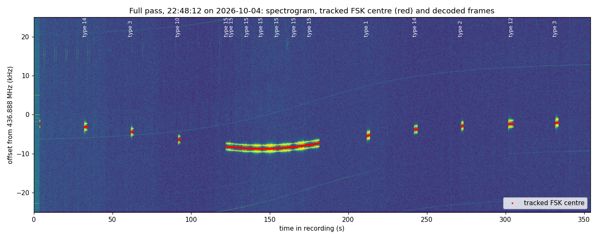

# UNNE-1B Decoder

[](https://github.com/N6RFM/UNNE-1B-Decoder/actions/workflows/ci.yml)

Decode the **UNNE-1B (HADES-E2)** amateur-radio satellite straight from an SDR recording:
200 baud FSK telemetry (CRC-checked, with the official field-by-field readout) and the
**CODEC2 voice message** (to a WAV file) - with **automatic Doppler / frequency tracking**,
so you never have to chase the signal by hand.

UNNE-1B is a 1.5P PocketQube built by [AMSAT-EA](https://www.amsat-ea.org/) with Universidad Nebrija,
downlink **436.888 MHz**. This project is an independent, open-source ground-station decoder; it is
not an AMSAT-EA product.

```
IQ file / SDR  ->  FSK tracker (finds the signal anywhere in the band, follows its drift)
               ->  demodulator + clock recovery -> sync 0xBF35 -> descramble -> CRC16
               ->  telemetry text  /  JSON lines  /  CODEC2 700C voice -> WAV
```



## What it does

* **Reads** SDR IQ recordings (complex float32 by default; int16 and uint8 too) at any sample rate.
* **Finds and tracks** the two-tone FSK signal automatically. In the example pass the centre moved from
  -2.0 kHz to -8.4 kHz and back; the tracker handled all of it without a tuning control.
* **Decodes all UNNE-1B telemetry packets** (types 1-14) with CRC-CCITT-FALSE verification and
  soft-decision repair of up to 3 bit errors.
* **Decodes CODEC2 voice** (type 15) - 10 x 28-bit Codec2 700C frames per packet - into a WAV,
  with optional pitch-preserving speed-up.
* **Optional official decode text**: run AMSAT-EA's own `hadesr.dll` inside an x86 emulator
  (no Wine needed) to get the labelled values (battery voltage, temperatures, ...). You supply the DLL.
* **GNU Radio Companion flowgraph** with live plots, using the very same decoder code.
* **Tested**: 64 automated tests, including a cross-check against AMSAT-EA's reference C code and
  synthetic signals of every packet type anywhere in the band.

## Results from a real pass

A 354 s, 50 ksps recording of the pass of **2026-10-04 22:48:12** decodes to 45 frames
(8 telemetry packets, all CRC OK, plus a 37-packet voice stream). Full details in
[docs/example-pass.md](docs/example-pass.md).

| Pass time | Packet | Satellite clock | Highlights |
|---|---|---|---|
| 33 s  | type 14 time series (signal peak) | 192124 s | 30 samples, all 0 dB |
| 63 s  | type 3 status | 192154 s | antenna deployed, transponder off, battery "fully charged" |
| 93 s  | type 10 Nebrija game payload | 192184 s | week 0, data `03 00 00 01 02 00 02 01` |
| 123-182 s | type 15 CODEC2 voice | - | 37 packets -> 14.8 s of audio |
| 213 s | type 1 power | 192304 s | panels 0 mW, battery 4097 mV, 35 mA out |
| 243 s | type 14 time series (noise) | 192334 s | 30 samples, all 0 dB |
| 273 s | type 2 temperatures | 192364 s | all sensors -14 ... -4 degC |
| 303 s | type 12 ephemeris | - | all zeros (no TLE uploaded yet) |
| 333 s | type 3 status | 192424 s | same as at 63 s |

## Quick start

```bash
git clone https://github.com/N6RFM/UNNE-1B-Decoder.git
cd UNNE-1B-Decoder
pip install -e .                      # numpy + scipy
sudo apt install codec2               # only needed for the voice WAV (provides c2dec)

# decode one of the bundled example recordings
unne1b-decode examples/iq/pass_t211s_type01.iq --fs 50000
```

Output:

```
171520 samples, 3.4 s at 50000 sps
=== UNNE-1B packet type 1 (Power) from UNNE-1B  [CRC OK] ===
sclock: 192304 s  (2d 05:25:04 since boot)
data (descrambled): 30ef02000000000000002bb66d6ff373533f00f40123001000000000
FSK signal tracking: 1 burst(s) found
  t=   0.8-   2.7 s  centre   -5288 Hz  (drift +173 Hz)
1 valid frame(s)
```

With your own copy of AMSAT-EA's `hadesr.dll` you get every field labelled
(`pip install -e .[dll]` first - see [docs/dll-emulation.md](docs/dll-emulation.md)):

```bash
unne1b-decode examples/iq/pass_t211s_type01.iq --fs 50000 --dll /path/to/hadesr.dll
```

```
vbat1 : 4097 mV bat voltage read in EPS.ADC
ibat  :   35 mA (Current flowing out from the battery)
...
```

Voice, from a recording that contains it:

```bash
unne1b-decode examples/iq/pass_t122s_voice.iq --voice-wav voice.wav
unne1b-decode your_pass.iq --log frames.jsonl --voice-wav voice.wav --voice-speed 1.15
```

GNU Radio: open `grc/unne1b_decoder.grc`, set the `iq_file` variable (see
[docs/gnuradio.md](docs/gnuradio.md)), run.

## Documentation

| Document | Contents |
|---|---|
| [Getting started](docs/getting-started.md) | install, first decode, options, output formats, SDR recording tips |
| [Protocol](docs/protocol.md) | air interface, frame layout, scrambler, CRC, every packet type, voice format |
| [Signal processing](docs/signal-processing.md) | tone detector, clock recovery, sync search, bit-error repair |
| [Frequency tracking](docs/tracking.md) | how the signal is found and followed automatically |
| [Voice](docs/voice.md) | CODEC2 700C packing, the XOR whitening, speed options |
| [GNU Radio](docs/gnuradio.md) | the flowgraph, variables, live SDR use |
| [DLL emulation](docs/dll-emulation.md) | using `hadesr.dll` without Wine |
| [Example pass](docs/example-pass.md) | the full recording, burst by burst |
| [Reverse-engineering notes](docs/reverse-engineering-notes.md) | what was tried, what worked, what didn't |
| [Troubleshooting](docs/troubleshooting.md) | common problems |
| [Limitations and roadmap](docs/limitations-and-roadmap.md) | known gaps |
| [Development](docs/development.md) | tests, build tools, project layout |

## Repository layout

```
src/unne1b/        core.py (protocol, tracker, deframer), cli.py, voice.py
grc/               GNU Radio Companion flowgraph (generated from core.py)
examples/iq/       three short IQ excerpts cut from the full pass (6.6 MB)
examples/results/  decoded frames, tracking report, voice WAVs from the full pass
docs/              documentation and figures
tests/             pytest suite + reference vectors from AMSAT-EA's C code
tools/             build_grc.py, build_standalone.py, make_plots.py
extras/soundmodem/ experimental audio route through UZ7HO soundmodem (not needed)
```

The full 142 MB recording is not part of the repository; the three excerpts are exact slices of it and
the figures and result files were produced from the full file.

## Status and honesty notes

* Telemetry types 1, 2, 3, 10, 12 and 14 were decoded from real signals with a valid CRC; types 4, 5,
  6, 8 and 9 have only been verified on synthetic packets (they were not transmitted during the pass).
* The voice audio is no longer garbled once the XOR key is applied (the maintainer's listening test: "much
  better", pace a little slow) but voice packets have **no CRC**, so bit errors cannot be detected. The
  message content has not been transcribed or verified.
* The measured FSK tone spacing is about **1.64 kHz**, not the 1125 Hz written in the AMSAT-EA
  document (v1.01). Decoding does not depend on it. See [reverse-engineering notes](docs/reverse-engineering-notes.md).
* See [limitations](docs/limitations-and-roadmap.md) for the full list.

## Credits and licence

* Code: MIT (see [LICENSE](LICENSE)). Documentation and example data: CC BY 4.0.
* The air-interface description is AMSAT-EA's *UNNE-1B - Descripcion de transmisiones* (v1.01).
* The voice XOR key and the scrambler/CRC cross-check vectors come from AMSAT-EA's
  [HADES-SA_SpinnyONE](https://github.com/AMSAT-EA/HADES-SA_SpinnyONE) repository (CC BY 4.0).
* `hadesr.dll` is AMSAT-EA's software and is **not** included; see [NOTICE.md](NOTICE.md).
