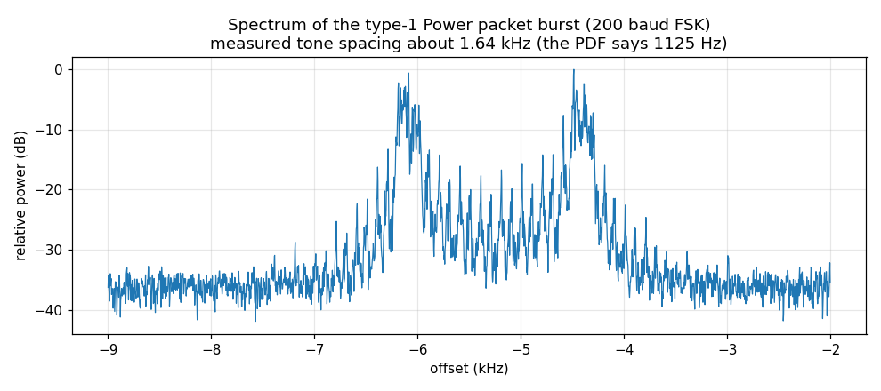
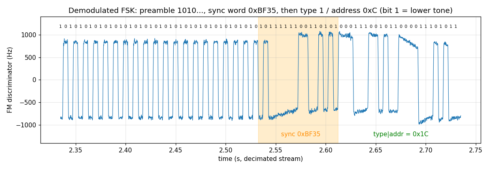
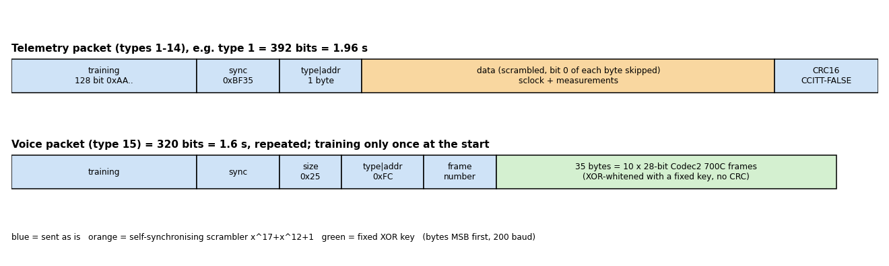

# UNNE-1B air interface

Sources: AMSAT-EA *UNNE-1B - Descripcion de transmisiones* v1.01 (10 Feb 2026), AMSAT-EA's open decoder
sources for the sister satellite HADES-SA (CC BY 4.0), and measurements on a real pass. Where the document and the real
signal disagree, this page says so and states what the decoder implements.

## Physical layer

| Item | Value |
|---|---|
| Downlink | 436.888 MHz |
| Modulation | binary FSK |
| Baud rate | **200 baud** (initial; can be raised by telecommand up to 2400) |
| Mark / space | lower tone = **mark = bit 1**, higher tone = **space = bit 0** |
| Tone spacing | document: 1125 Hz. **Measured: about 1.64 kHz** (1608-1654 Hz in every burst) |
| Bit order | bytes are sent **MSB first** |
| Occupied bandwidth | about 3 kHz (measured: two tones 1.64 kHz apart plus 200 baud sidebands) |

Each transmission is a short burst; in "debug" mode the satellite sends one packet in each 30 second slot,
cycling through the packet types (the voice stream occupies about a minute).





## Frame layout (telemetry, types 1-14)



| Field | Size | Value |
|---|---|---|
| Training | 128 bits | `0xAA` x 16 (alternating 1010...). The document's text says 64 bits, its tables say 128; 128 is what is received |
| Sync | 16 bits | `0xBF35` |
| Type / address | 8 bits | high nibble = packet type, low nibble = source address (`0xC` = UNNE-1B, `0xB` = MARIA-G) |
| Data | per type | **scrambled** (see below); typically starts with the 32-bit satellite clock, little-endian |
| CRC | 16 bits | CRC-16/CCITT-FALSE, big-endian, **over the on-air (scrambled) bytes** |

The type/address byte also gives the packet length, so a receiver knows where the CRC is.

### Packet types, sizes and durations

Total bytes include 16 training + 2 sync + 1 type/address + data + 2 CRC.

| Type | Content | Total bytes | Airtime at 200 baud |
|---|---|---|---|
| 1 | Power: panel power, bus/battery voltages, currents, RX levels | 49 | 1.96 s |
| 2 | Temperatures (panels, EPS, TX, RX, CPU; 0.5 degC steps) | 35 | 1.40 s |
| 3 | Status: resets, counters, transponder mode, antenna state | 47 | 1.88 s |
| 4 | Power statistics (min/max since reset) | 53 | 2.12 s |
| 5 | Temperature statistics | 45 | 1.80 s |
| 6 | Sun-sensor samples | 153 | 6.12 s |
| 8 | Antenna deployment parameters | 49 | 1.96 s |
| 9 | Extended power statistics (INA219 channels) | 141 | 5.64 s |
| 10 | Universidad Nebrija "guessing game" payload | 35 | 1.40 s |
| 12 | Ephemeris (TLE elements, on-board position) | 82 | 3.28 s |
| 14 | Time series: 30 samples, one every 3 min, of one variable | 56 | 2.24 s |
| 15 | CODEC2 voice, see below | 40 per packet | 1.6 s per packet |
| 7, 11, 13 | not used | | |

Time-series variables: 0 = signal peak, 1 = noise (mode), 2 = battery voltage, 3 = CPU temperature,
4 = panel A temperature, 5 = mean of the four panel temperatures. One variable is sent per packet.

The decoder uses these sizes to know how many bits to take after the sync word.
Field-level interpretation of the data bytes (scaling and bit packing, which are not simple multiples of bytes) is
done by `hadesr.dll`; this project verifies and extracts the frame and, with `--dll`, prints the DLL's text
for it. See [dll-emulation.md](dll-emulation.md).

## Scrambler

Every telemetry packet's **data** (everything between the type/address byte and the CRC) is scrambled with a
multiplicative self-synchronising scrambler, polynomial `x^17 + x^12 + 1`, with the register initialised to
`0x2C350000` for each packet.

```c
// AMSAT-EA reference (genesis_scrambler.c), descrambler:
for (b = 7; b > 0; b--) {                 // NOTE: bit 0 of every byte is skipped
    in  = (byte >> b) & 1;
    out = (in ^ (reg >> 16) ^ (reg >> 11)) & 1;
    set bit b of byte to out;
    reg = ((reg << 1) | in) & 0x1FFFF;
}
```

Two details that are easy to get wrong:

1. **Bit 0 of every byte is neither scrambled nor shifted into the register** (the loop stops at `b > 0`). This is
   in AMSAT-EA's reference C code and in `hadesr.dll`; it is not mentioned in the PDF. A textbook G3RUH-style
   descrambler produces garbage.
2. The register is reset for every packet and only the scrambled field is passed through it.

Check against the PDF's example: scrambled `C7 43 4C 27 4B 17 13 D7 6B 05 AA D1 89 97 47 C8` descrambles to
`"GENESIS-Genesis"`. The test-suite does this (`tests/test_protocol.py`).

## CRC

CRC-CCITT-FALSE: polynomial `0x1021`, initial value `0xFFFF`, no reflection, no final XOR (`"EASAT-2"` -> `0x7D58`).
It covers the **type/address byte through the last data byte exactly as transmitted - i.e. the scrambled
bytes**, and is sent big-endian. (Computing it over the descrambled bytes, which is the natural reading of the
PDF, never matches.)

## Voice packets (type 15)


A voice burst is: 128-bit training once, then back-to-back packets of 320 bits:

| Field | Size | Value |
|---|---|---|
| Sync | 16 bits | `0xBF35` (repeated for every packet) |
| Size | 8 bits | `0x25` = 37 |
| Type / address | 8 bits | `0xFC` (type 15, address C) |
| Frame number | 8 bits | 0, 1, 2, ... (not scrambled) |
| Payload | 280 bits | 35 bytes, see [voice.md](voice.md) |

There is **no CRC** on voice packets and the data is **not** run through the scrambler; instead the 35 bytes are
XOR-ed with a fixed key (see [voice.md](voice.md)). One packet is 1.6 s of airtime and carries 0.4 s of speech.

## Time

The first data field of types 1-5 is the satellite clock in seconds since the CPU started
(`sclock`). In the example pass `sclock = 192092 + t` where `t` is seconds into the recording, so the
clock tracks real time and consecutive slots are exactly 30 s apart. The ephemeris packet (type 12) is
the only one with UTC, and it was all zeros (no TLE uploaded yet).
