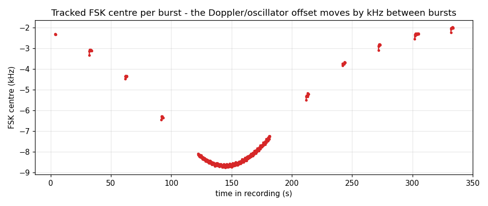

# Automatic frequency tracking

The satellite's FSK signal does not stay on one frequency: Doppler shift (about +-10 kHz at 437 MHz) plus the
transmitter's and your receiver's oscillator offsets move it by several kHz during a pass. A fixed-frequency
decoder needs constant retuning. `FskCentreTracker` removes that chore.

## What it does

1. Every **0.1 s** it takes an 8192-point FFT (at 50 ksps: 0.164 s of signal, 6.1 Hz bins) of the wideband IQ. Above 80 ksps the FFT
   grows with the sample rate (at most 2^18 points), so the bins stay about 6 Hz wide.
2. It looks for the **two-tone signature** of the FSK: two spectral peaks, both at least 15 dB above the noise floor
   (median of the spectrum), 1.0-2.4 kHz apart, the weaker no more than 10 dB below the stronger. Peaks are refined
   with parabolic interpolation. The midpoint of the pair is the **FSK centre**.
3. A detection becomes **accepted** only when 3 consecutive hops agree within 250 Hz. This rejects noise spikes,
   receiver spurs and one-off interference.
4. The stream is **delayed by 1.2 s** (look-ahead) and mixed down by the accepted centre, so the signal arrives
   at 0 Hz in the channel filter. The centre used for each 0.1 s block is:
   * the **median of accepted detections within +-0.35 s** (this follows drift inside a burst);
   * else the **first accepted detection within the next 0.6 s** (a burst is about to start - jump there early);
   * else **hold the last accepted value**.

Because of the look-ahead, the mixer is already on the right frequency when a burst begins, even if the centre moved
by 1-3 kHz since the previous burst. A burst's 128-bit preamble (0.64 s) is therefore never lost.

## Results on the example pass

Ten bursts were found; nine are real packets (the tenth, at 3.7 s, is a spur that produced nothing):

| Burst (s) | Centre | Drift within burst | Content |
|---|---|---|---|
| 3.7-4.1 | -2307 Hz | -16 Hz | spur (nothing decoded) |
| 32.1-33.9 | -3087 Hz | +220 Hz | type 14 |
| 61.9-63.3 | -4352 Hz | +121 Hz | type 3 |
| 91.9-93.2 | -6324 Hz | +77 Hz | type 10 |
| 122.2-181.7 | -8437 Hz | +832 Hz | voice (37 packets, 59 s continuous) |
| 211.9-213.8 | -5289 Hz | +283 Hz | type 1 |
| 242.0-244.1 | -3732 Hz | +129 Hz | type 14 |
| 271.9-273.2 | -2816 Hz | +268 Hz | type 2 |
| 301.9-305.1 | -2297 Hz | +266 Hz | type 12 |
| 331.9-333.7 | -2004 Hz | +219 Hz | type 3 |

The centre is **not** a monotonic Doppler S-curve: it drifts from -3.1 kHz to -8.4 kHz at 150 s and back to -2.0 kHz
(a V shape). Fainter, continuous carriers elsewhere in the same recording do follow an S-curve (visible in the
[whole-pass spectrogram](img/pass_overview.png)); what they are, and why the FSK offset behaves differently, is an open
question (see [limitations](limitations-and-roadmap.md)). The tracker does not depend on any model - it measures the
signal directly - so this does not affect decoding.

## Parameters (`FskCentreTracker`)

| Argument | Default | Meaning |
|---|---|---|
| `fs` | - | input sample rate |
| `delay_s` | 1.2 | look-ahead; must be at least `2 * nfft / fs` |
| `nfft` | 8192 | FFT size for detection |
| `hop_s` | 0.1 | detection interval |
| `min_db` | 15 | peaks must exceed the median spectrum by this much (CLI: `--min-db`) |
| `spacing` | (1000, 2400) Hz | allowed tone separation |
| `persist` | 3 | consecutive agreeing hops required |
| `spread` | 250 Hz | allowed centre disagreement between those hops |
| `window_s` | 0.35 | averaging window for the centre inside a burst |
| `lead_s` | 0.6 | how early the mixer jumps to an upcoming burst |

If your satellite's tone spacing were different (for example after a telecommand changes the data rate), widen
`spacing`. Lower `min_db` (for example 10-12) for weak signals; expect more spurious detections, which the
persistence rule and the CRC will still filter.

## Costs and limits

* **Latency 1.2 s** in streaming use. With a file the last 1.2 s of the recording cannot be output unless you append
  silence; the command-line tool flushes at the end, and the GNU Radio file source block appends 2 s of silence for
  this reason.
* The tracker looks for the *pair of tones*. It cannot lock onto an unmodulated carrier or onto a voice FM signal.
* Only one signal is tracked at a time; the strongest valid pair wins.
* The whole recorded band must contain the signal. With a 50 ksps recording the usable range is about +-24 kHz.
