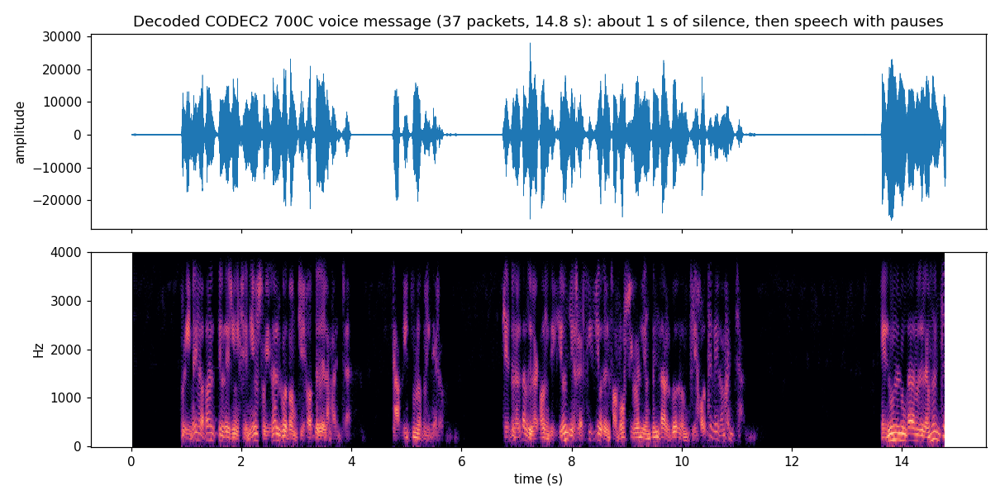

# CODEC2 voice

UNNE-1B's prerecorded voice message is sent as a stream of type 15 packets (see [protocol.md](protocol.md)).
In the example pass 37 packets (numbers 0-36, 59 s of airtime) carry **14.8 s** of audio.



## How the payload is built

Each packet carries **35 bytes = 280 bits**. The transmission document calls them "280 raw Codec2 bits". The
correct reading turned out to be:

```
35 bytes  --XOR with a fixed 35-byte key-->  280 bits = 10 consecutive 28-bit frames of Codec2 mode 700C
```

* **Codec2 700C** uses 28 bits per 40 ms frame, so a packet is 10 frames = 400 ms of speech, and no other standard mode
  divides 280 bits evenly except 1400 (5 x 56). The mode is confirmed by AMSAT-EA's reference merge tool, which
  writes a Codec2 file header with mode byte 8 (`CODEC2_MODE_700C`).
* **The XOR key** is fixed (the same bytes for every packet) and comes from AMSAT-EA's HADES-SA reference decoder
  (`byte_version/main.c` in [HADES-SA_SpinnyONE](https://github.com/AMSAT-EA/HADES-SA_SpinnyONE), (c) AMSAT EA, CC BY 4.0; copied unchanged, see [NOTICE.md](../NOTICE.md)):

  ```
  ed 15 d5 3b 34 70 e0 fd ed 83 90 db aa 2e 25 d6 5e 81 41 86 bd 67 79 5d
  70 a1 13 ce 50 0c 19 ca fb 44 0d
  ```

  It is *not* the telemetry scrambler. Without the XOR the data is still structured (this is why the 700C layout can
  be recognised in the raw bits) but decodes to noise.
* **Padding**: `c2dec` reads each 28-bit frame as 4 bytes (28 bits followed by four zero bits). The 35 bytes are
  therefore cut into ten 28-bit frames and each is padded.
* **Missing packets** are replaced by 40 zero bytes (10 silent frames), like AMSAT-EA's merge tool.

`unne1b.core` has the helpers (`voice_unwhiten`, `voice_pad_700c`, `voice_assemble`); `unne1b.voice` runs `c2dec`.

## Usage

```bash
# straight from the IQ
unne1b-decode pass.iq --fs 50000 --voice-wav voice.wav     # writes voice_UNNE-1B.wav (the satellite is added to the name)

# or in two steps
unne1b-decode pass.iq --log frames.jsonl
unne1b-voice frames.jsonl voice.wav
unne1b-voice frames.jsonl voice_fast.wav --speed 1.15      # same pitch, 15 % faster
unne1b-voice frames.jsonl voice_tape.wav --tape 1.15       # faster and higher, like a quick tape
```

`unne1b-voice` accepts the `.jsonl` log (it then uses the packet numbers: sorts, drops duplicates, fills gaps), a **per-type
output folder** made with `--outdir`, or a raw payload file written by `--c2out` (35 bytes per packet, in order).

### Every WAV says which satellite it is

* **In the file name:** `voice.wav` becomes `voice_HADES-SA.wav`, `voice_UNNE-1B.wav`, `voice_HADES-L.wav` ... (nothing is added if
  the name already contains the satellite; `--exact-name` / `--voice-exact-name` keep the name exactly as given).
* **Inside the file,** so the origin survives renaming: standard WAV tags (title "HADES-SA voice message (CODEC2 700C)", artist =
  the satellite, source = the recording or folder, date, and a comment with the source address, the frames received and missing,
  frames dropped as corrupted, copies used and the program version). Most players show them; `ffprobe voice_HADES-SA.wav` lists them.
* **Never mixed:** if the input holds voice from more than one satellite (UNNE-1B and HADES-SA are only 13 kHz apart and can be
  in one recording), each gets its own WAV. A raw payload file does not say who sent it: name the satellite with `--sat HADES-SA`
  (otherwise the file is marked `unknown-satellite`).

### Several receptions, several passes

Voice packets have **no CRC**, so a bit error in a frame number or in the data goes unnoticed.

* **Isolated frame numbers** far from all the others (for example 44, 74 and 246 among frames 0-36 in a real HADES-SA folder) are
  corrupted numbers; they are dropped instead of stretching the audio with minutes of silence (`--keep-all` keeps them).
* **A frame received several times:** the most frequent identical copy is used (`--pick latest` or `first` to choose otherwise).
* **A folder holds many passes,** and different passes can carry different content or heavy errors, so blending everything can
  give a patchwork. By default the pass with the most frames is used (in the real HADES-SA folder: the 2026-04-01 14:20 pass with
  all 37 frames, which is practically what UNNE-1B sends). `--list-passes` shows every pass and its frames, `--pass N` picks one,
  and `--combine` merges all passes (use it when the passes are partial views of the same message).

```bash
unne1b-voice ~/hades-sa --list-passes                   # which passes are in the folder
unne1b-voice ~/hades-sa                                  # best pass -> ~/hades-sa/voice_HADES-SA.wav
unne1b-voice ~/hades-sa --combine voice_all.wav          # all passes merged -> voice_all_HADES-SA.wav
unne1b-voice raw_payloads.c2 --sat HADES-L voice.wav     # a raw file: say whose it is
```

Output: 8 kHz, 16-bit, mono WAV. Example files from the pass: `examples/results/voice_700C.wav` (14.8 s) and
`voice_700C_speed1.15.wav` (12.9 s).

## What the message says

It is the opening of Cervantes' *Don Quijote de la Mancha*, read in Spanish. Transcribed by ear by the maintainer
(listening at 115-120 % speed, so the time stamps are in the sped-up playback):

| Time | Heard |
|---|---|
| 0:00 | *Primera parte del Ingenioso Hidalgo Don Quijote de la Mancha. Capítulo primero.* |
| 0:06 | *Que trata de la condición y ejercicio del famoso y valiente Hidalgo Don Quijote de la Mancha.* |
| 0:12 | *En un lugar de la Mancha...* |

The decoded audio ends within about a second after that, in mid-sentence: 37 packets x 0.4 s = 14.8 s, and the sister
satellite HADES-SA stores voice recordings of up to 15 s (its description also mentions a recording of text from Don
Quixote). So the cut-off is expected. This confirms the mode (Codec2 700C), the XOR key and the padding rule.
See [examples/results/voice_transcript.md](../examples/results/voice_transcript.md).

## What the audio is like

* About 0.9 s of silence, then speech with pauses (about 5 s of the 14.8 s are pauses).
* **Pace:** the maintainer finds it natural at **115-120 %** speed. Whether the satellite's recording is simply a slow
  reading or the time base of the decoded audio is a little off is **not known**. The measured pitch is a median of
  about 108 Hz at 1.0x (about 124 Hz with `--tape 1.15`), plausible for a male voice either way; the reading rate works
  out at about 4.4 syllables per second at 1.0x and about 5.1 at 1.15x (both within the range of Spanish read-aloud
  speech). So the default output is left at the faithful 1.0x, and `--speed 1.15` / `--voice-speed 1.15` is the
  recommended listening setting. `--speed` keeps the pitch; `--tape` changes pitch with speed: use whichever sounds
  more natural to you.
* Without the XOR key the same data decodes to garble; with it the first listening test said "much better", and the
  second one identified the text.
* There is no CRC on voice packets, so bit errors cannot be detected or corrected. A noisy recording gives
  occasional bursts of garbled audio rather than missing frames.

## How the mode was identified (for the curious)

1. Raw payload bits showed strong correlation between corresponding bit positions 28 apart, in successive packets
   (for example packet-bit positions 46, 102, 158, 186, 214, 242 - one bit per frame), which means 28-bit frames starting at the packet's first bit.
2. A K=7 rate-1/2 convolutional FEC (mentioned on a nanosats.eu page for "HADES-L (UNNE-1B)") was tested on these
   packets and ruled out (Viterbi path metrics were no better than for random data).
3. The reference decoder in AMSAT-EA's repository showed the XOR key and the padding rule.

Details and dead ends are in [reverse-engineering-notes.md](reverse-engineering-notes.md).
